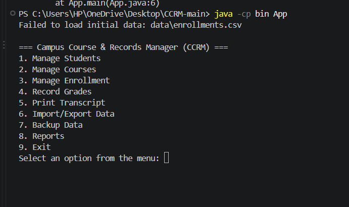
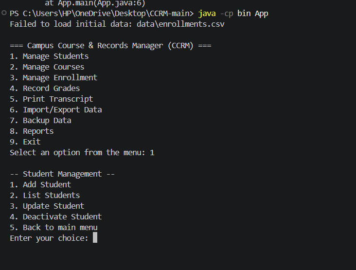
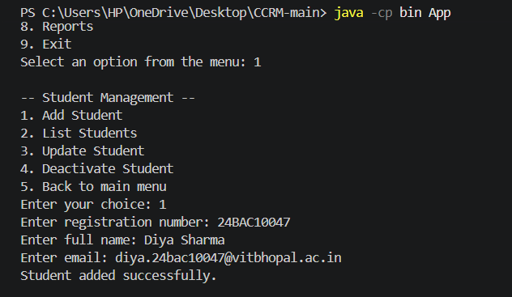
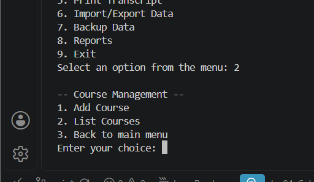
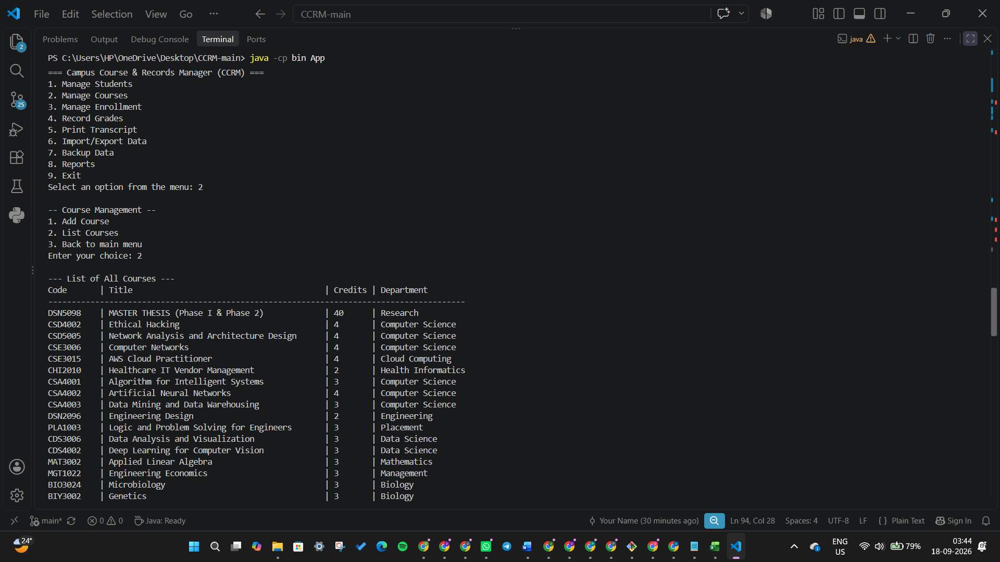
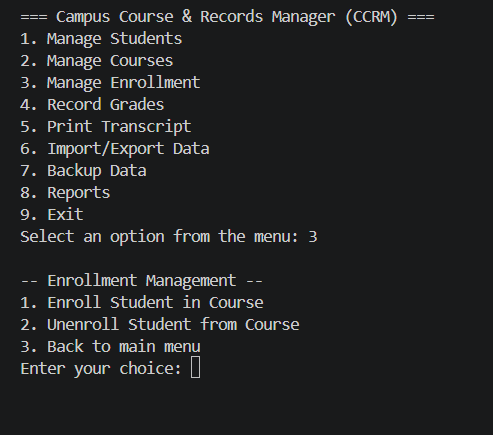
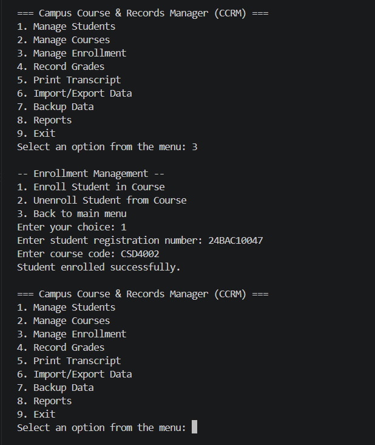
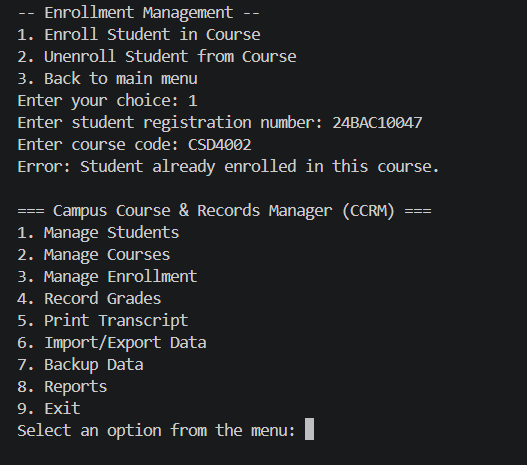
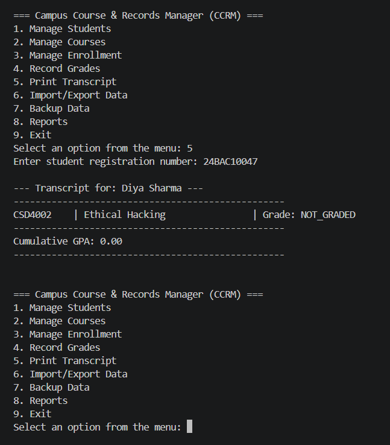

# Campus Course & Records Manager (CCRM)

A console-based Java application for managing student and course records at an educational institution — built as a course project applying core Java, OOP, and file I/O concepts.

## Overview

CCRM lets an administrator manage students, courses, enrollments, and grades entirely from the command line, with data persisted to CSV files and backup support.

## Features

- **Student Management** — add, update, and view student records
- **Course Management** — create and manage course offerings, assign instructors and semesters
- **Enrollment & Grading** — enroll students in courses with validation (duplicate-enrollment and max-credit-limit checks), record grades, and generate transcripts
- **Data Import/Export & Backup** — load/save student, course, and enrollment data via CSV; back up application data

## Technologies Used

- **Java 17** (JDK)
- Core Java: OOP (inheritance, polymorphism), Collections Framework, custom exceptions
- CSV-based file I/O for persistence
- Console-based CLI (no external frameworks)

## Project Structure
- CCRM-main/
  - bin/ - Compiled .class files
  - data/ - CSV data (students, courses, enrollments)
  - src/edu/ccrm/
    - cli/ - MainMenu (console UI)
    - config/ - AppConfig
    - domain/ - Person, Student, Instructor, Course, Enrollment, Grade, Semester
    - exceptions/ - DuplicateEnrollmentException, MaxCreditLimitExceededException
    - io/ - ImportExportService, BackupService
    - service/ - StudentService, CourseService, EnrollmentService, TranscriptService
    - util/ - Validators, Comparators, RecursionUtils
  - README.md


## Steps to Install & Run

**Prerequisite:** JDK 17 or higher.

```bash
# 1. Clone the repository
git clone https://github.com/diyasharma22/CCRM-main.git
cd CCRM-main/src

# 2. Compile
javac -d ../bin $(find . -name "*.java")

# 3. Run
cd ../bin
java App
```

To run with assertions enabled:
```bash
java -ea App
```

## Instructions for Testing

1. Launch the application (`java App` from the `bin` directory).
2. Use the console menu to:
   - Add a new student and a new course
   - Enroll the student in the course — try enrolling the same student twice to confirm `DuplicateEnrollmentException` is handled
   - Enroll a student past the credit limit to confirm `MaxCreditLimitExceededException` is handled
   - Record a grade and generate a transcript for the student
   - Export data to CSV and confirm the files appear under `data/`

## Screenshots

### Main Menu


### Student Management


### Adding a Student


### Course Management


### Listing All Courses


### Enrollment Menu


### Enrolling a Student in a Course


### Duplicate Enrollment Error Handling


### Student Transcript



---

## Java Background

**Evolution of Java**
- 1995 — Released by Sun Microsystems.
- 2004 — Java 5 introduced generics, annotations, and autoboxing.
- 2014 — Java 8 introduced lambda expressions and the Streams API.
- Present — Java 17 is the current Long-Term Support (LTS) release.

**Java Editions**
- **Java SE** — core platform for desktop, server, and console apps.
- **Java EE** — superset of SE for large-scale, distributed, enterprise apps.
- **Java ME** — subset for resource-constrained/embedded environments.

**JDK vs JRE vs JVM**
- **JVM** — runs Java bytecode; makes Java "write once, run anywhere."
- **JRE** — JVM + core libraries, for running Java programs.
- **JDK** — JRE + development tools (`javac`, debugger); required to build this project.

## Syllabus-to-Code Mapping

| Syllabus Topic | Where It's Demonstrated |
|---|---|
| Object-Oriented Programming (OOP) | `edu.ccrm.domain` package (`Person`, `Student`, `Instructor`, `Course`, `Enrollment`) |
| Data Persistence & File I/O | `edu.ccrm.io` package (`ImportExportService`, `BackupService`) |
| Collection Framework | `edu.ccrm.service` package (e.g. `StudentService` using `List<Student>`) |
| Exception Handling | `edu.ccrm.exceptions` (`DuplicateEnrollmentException`, `MaxCreditLimitExceededException`) |
| Inheritance & Polymorphism | `Person` base class extended by `Student` and `Instructor` |
| Console-based I/O | `edu.ccrm.cli.MainMenu` |

